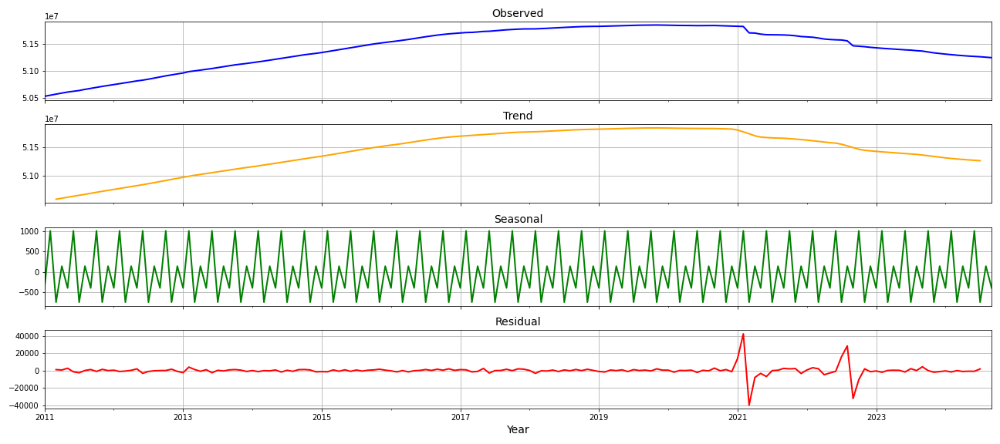
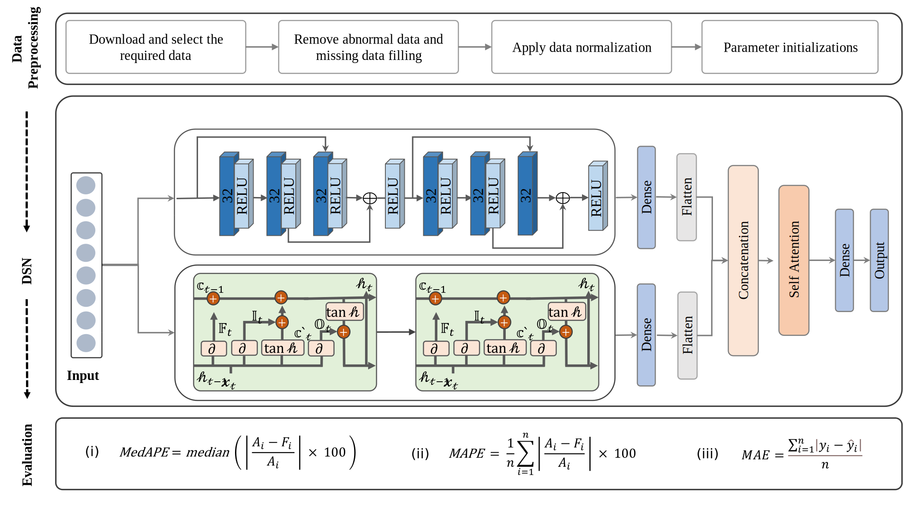
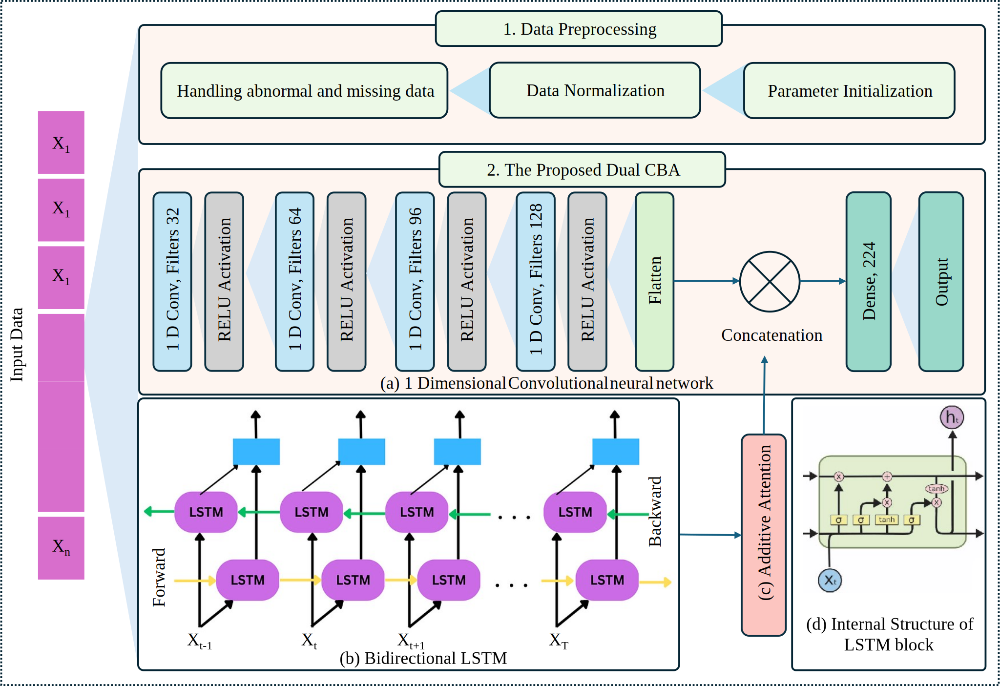

# Koreapopulation: Korea Demographic Projections

## Introduction:

Population forecasting plays a crucial role in planning and decision-making across various domains, including urban development, resource allocation, and public policy. However, existing methodologies often fail to fully capture the complex spatiotemporal patterns present in historical data. To address this limitation, a novel approach is proposed that leverages advanced architectures capable of parallel processing to simultaneously extract spatial and temporal features. The proposed method integrates multiple feature extraction techniques to capture both spatial and temporal dynamics effectively. These features are combined through a fusion mechanism, creating a comprehensive representation of the data. To mitigate the challenges of redundant information and potential overfitting, an attention-based mechanism is employed for optimal feature refinement. This ensures that only the most relevant features are utilized for population projection. Extensive experiments demonstrate the effectiveness of this approach, highlighting its ability to learn discriminative features and improve forecasting accuracy.

## Statistical Methods:

### Additive Decomposition:
Additive decomposition is applied to time series data to break it into four key components: observed, trend, seasonal, and residual. The observed component represents the raw data as recorded. The trend captures the underlying long-term patterns, providing insights into the overall direction of change over time. The seasonal component identifies recurring patterns or cycles within the data, reflecting periodic fluctuations. The residual isolates irregular or random variations not explained by the trend or seasonality, aiding in the identification of anomalies and refinement of analysis.

## Assoicated Articles of the Project:
### Article 1:
The research introduces a Dual-Stream Network (DSN) for population forecasting that integrates Convolutional Neural Networks (CNN) and Long Short-Term Memory (LSTM) to simultaneously extract spatiotemporal features from historical data. These features are fused into a comprehensive vector, which is then refined using a Self-Attention Mechanism (SAM) to reduce redundancy and prevent overfitting. Experimental results show that this approach enhances the model's ability to capture discriminative patterns and improve the accuracy of population projections

### Article 2:
A dual-stream network for population projection is proposed, integrating 1D Convolutional Neural Networks (CNN), Bidirectional Long Short-Term Memory (BiLSTM), and an Additive Attention Mechanism (Dual CSA). The Dual CSA extracts spatiotemporal features in parallel from historical data, with the 1D-CNN and BiLSTM processing the data simultaneously. The attention mechanism is applied to select important features from the BiLSTM output, which are then concatenated with the CNN output to form a comprehensive feature vector. Extensive experiments are conducted to identify the optimal model for accurate population forecasting

## Result:
